  

### Diego Cedeño

**Systems builder** · Caracas, VE

I take processes from one domain and rebuild them as replicable systems: automation, internal tools and self-hosted infrastructure.

Tomo procesos de un área y los reconstruyo como sistemas replicables: automatización, herramientas internas e infraestructura self-hosted.

 

  &nbsp;&nbsp;&nbsp;
  &nbsp;&nbsp;&nbsp;
  &nbsp;&nbsp;&nbsp;
  &nbsp;&nbsp;&nbsp;
  &nbsp;&nbsp;&nbsp;
  &nbsp;&nbsp;&nbsp;
  &nbsp;&nbsp;&nbsp;
  

 

#### Plutón series · Serie Plutón

Ten space-themed micro web apps, each in its own repo with a live demo: vanilla HTML, CSS and JavaScript, animated SVG, no build step.

Diez microapps web de temática espacial, cada una en su propio repo y con demo en vivo: HTML, CSS y JavaScript vanilla, SVG animado, sin build.

  &nbsp;
  &nbsp;
  &nbsp;
  

  &nbsp;
  &nbsp;
  

  &nbsp;
  &nbsp;
  

 

  
  

<picture>
  <source media="(prefers-color-scheme: dark)" srcset="https://raw.githubusercontent.com/diegocedenno/diegocedenno/output/github-snake-dark.svg">
  <source media="(prefers-color-scheme: light)" srcset="https://raw.githubusercontent.com/diegocedenno/diegocedenno/output/github-snake.svg">
  
</picture>

 

  &nbsp;
  &nbsp;
  

